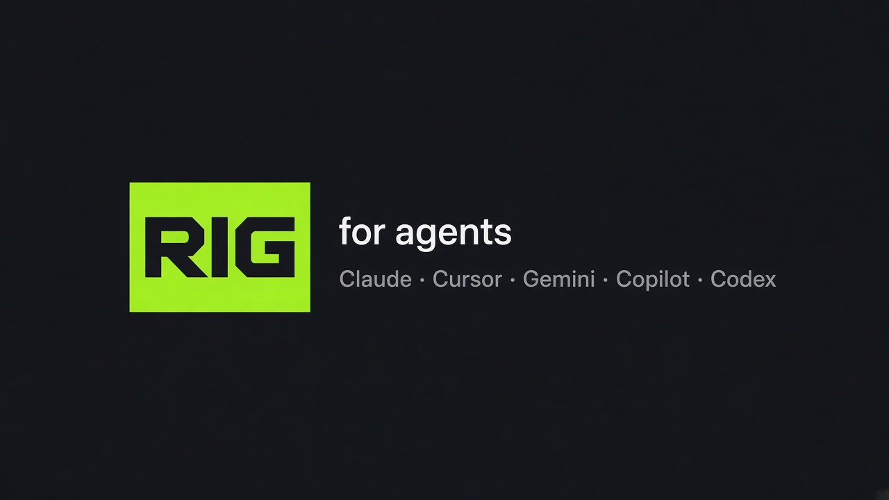
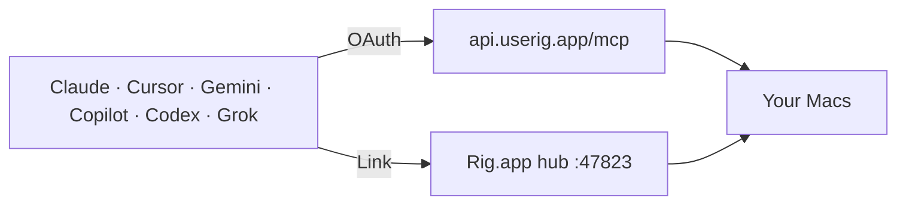

<p align="center">
  
</p>

<p align="center">
  <strong>One plugin. Every coding agent.</strong><br>
  Cloud MCP + skills so they stop guessing from a terminal.
</p>

<p align="center">
  <a href="https://userig.app">userig.app</a>
  ·
  <a href="https://userig.app/docs/mcp">docs</a>
  ·
  <a href="https://userig.app/download">download Mac app</a>
</p>

<p align="center">
  
  
  
  
  
  
</p>

This repository is **packaging only**. It is not the Rig product source. The Mac app and Cloud API stay private.

## What you get

| Surface | When | What the agent can do |
| --- | --- | --- |
| **Cloud MCP** `https://api.userig.app/mcp` | Signed in to Rig Cloud (OAuth 2.1 or account PAT) | Nine tools: catalog, health, ports, gated start / stop / restart on linked Macs |
| **Local hub** | Rig.app open → Connections → **Link** | Full hub: live logs, git/db, env, fleet/mesh |

Writes always need `confirm: true`. No checkout. No invented tokens.

### Cloud MCP tools (v1)

| Tool | Kind |
| --- | --- |
| `list_projects` | Read |
| `get_project` | Read |
| `get_status` | Read |
| `get_logs` | Read (limited without local hub) |
| `get_health` | Read |
| `who_owns_port` | Read |
| `start_project` | Write — `confirm: true` |
| `stop_project` | Write — `confirm: true` |
| `restart_project` | Write — `confirm: true` |



## Install

### One URL (most clients)

```
https://api.userig.app/mcp
```

OAuth 2.1, Streamable HTTP. The agent signs in in the browser on first tool call.

| Agent | Command / file |
| --- | --- |
| **Claude Code** | `claude --plugin-dir ./rig-plugin` · then `/plugin install` from the community marketplace once listed |
| **Cursor** | [cursor.directory/plugins/new](https://cursor.directory/plugins/new) with this repo, or paste the JSON below into `~/.cursor/mcp.json` |
| **Gemini CLI** | `gemini extensions install https://github.com/Rig-local/rig-plugin` |
| **VS Code / Copilot** | MCP: Add Server → HTTP → the URL above (config key is `servers`) |
| **Codex** | `codex mcp add rig --url https://api.userig.app/mcp` |
| **Grok Build** | PR to [xai-org/plugin-marketplace](https://github.com/xai-org/plugin-marketplace) pinning this repo SHA (see [MARKETPLACE.md](./MARKETPLACE.md)) |
| **Windsurf** | Cascade → Manage MCPs — field is `serverUrl`, not `url` |
| **Cline** | Point it at [`llms-install.md`](./llms-install.md) |

Cursor / Claude JSON:

```json
{
  "mcpServers": {
    "rig": {
      "type": "http",
      "url": "https://api.userig.app/mcp"
    }
  }
}
```

VS Code:

```json
{
  "servers": {
    "rig": {
      "type": "http",
      "url": "https://api.userig.app/mcp"
    }
  }
}
```

Windsurf:

```json
{
  "mcpServers": {
    "rig": {
      "serverUrl": "https://api.userig.app/mcp"
    }
  }
}
```

### Local hub (full tools)

1. [Download Rig](https://userig.app/download)
2. Open **Connections** → start the MCP hub → **Link** the agent you actually use
3. Prefer Link over hand-editing a bearer token

## Skills and commands

Same skills load in Claude, Cursor, Gemini, and Grok Build.

| Invoke | Does |
| --- | --- |
| `/rig:setup` | Install the Mac app, connect cloud MCP, Link the local hub |
| `/rig:rig-runtime` | When to use Rig tools instead of the terminal |
| `/rig:status` | List projects and run state |
| `/rig:health` | Account / hub health |
| `/rig:logs` | Recent logs |
| `/rig:start` · `/rig:stop` · `/rig:restart` | Lifecycle with `confirm: true` |

## Layout

```
plugin.json                 Agent Plugins (Cursor + portable)
mcp.json                    Agent Plugins MCP (streamable-http)
.mcp.json                   Claude Code + cursor.directory
.claude-plugin/plugin.json  Claude Code
.cursor-plugin/plugin.json  Cursor Marketplace
.codex-plugin/plugin.json   OpenAI Codex / ChatGPT packaging
.grok-plugin/plugin.json    Grok Build marketplace
gemini-extension.json       Gemini CLI gallery
skills/                     Agent Skills
commands/                   Slash commands
rules/                      Cursor: prefer Rig MCP
MARKETPLACE.md              Directory submit checklist (no secrets)
```

```bash
claude plugin validate . --strict
```

## Privacy

Cloud MCP sees the signed-in account’s catalog, device presence, and lifecycle commands you confirm. The local hub stays on your Mac.

[Privacy](https://userig.app/privacy) · [Terms](https://userig.app/terms) · [Support](https://help.userig.app)

## License

Apache License 2.0 for this packaging. Rig.app and the Cloud API are proprietary (Rich Harrington Ltd).
